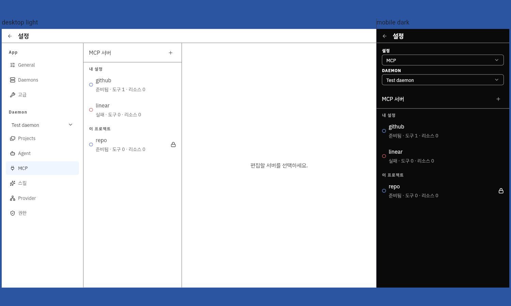
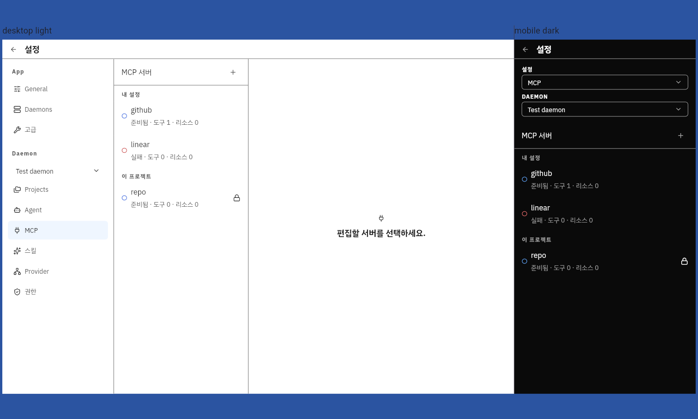
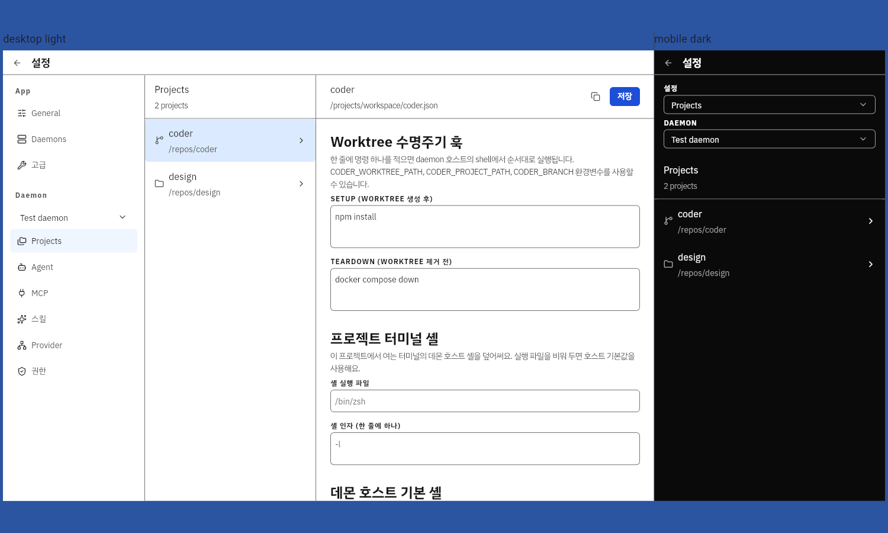
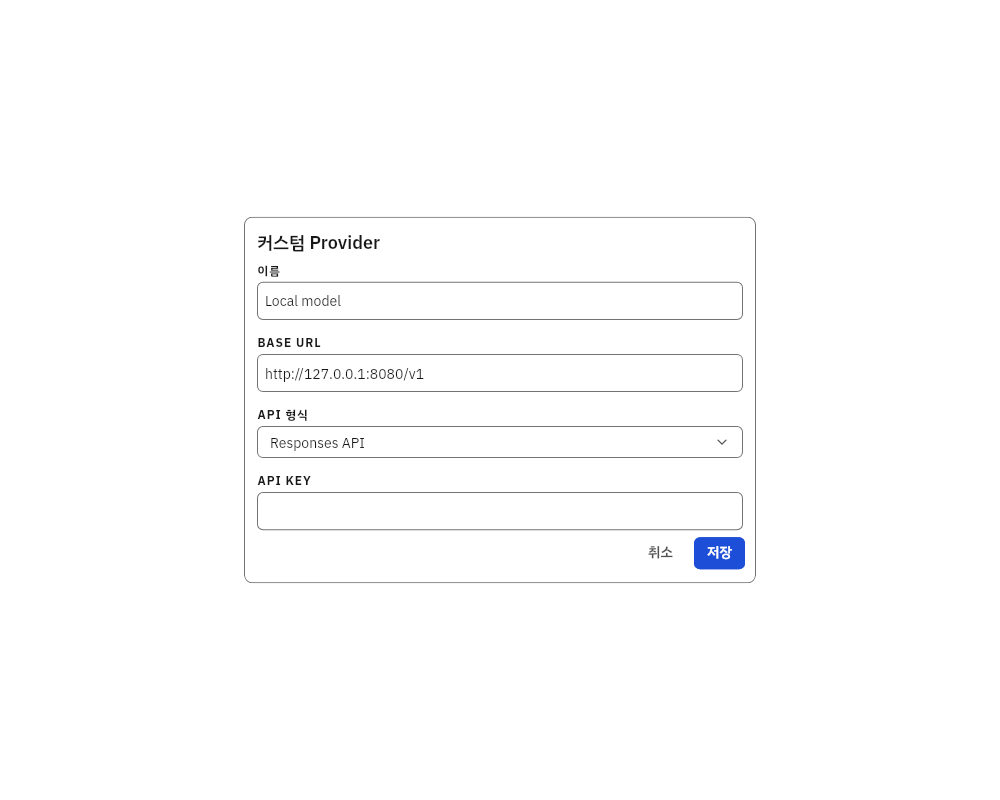
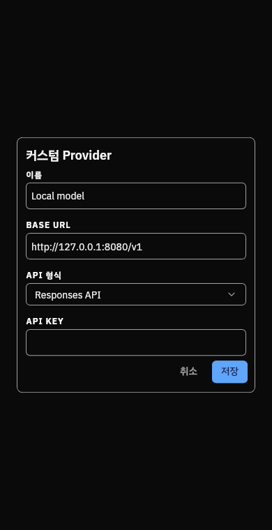
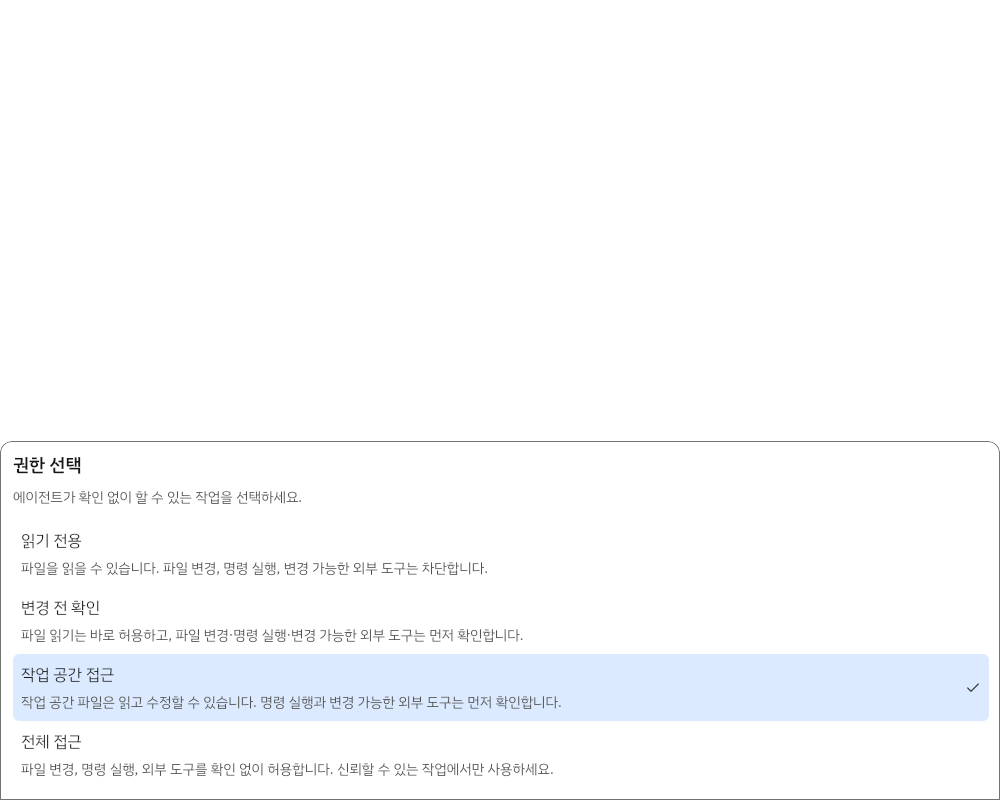
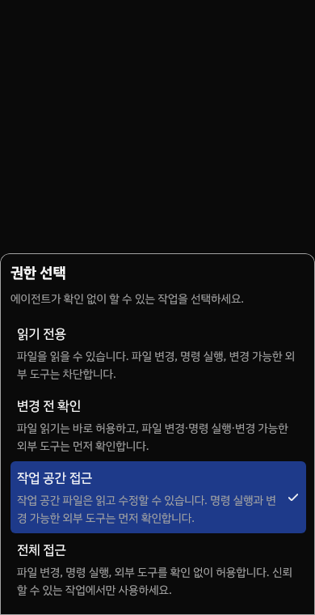

# 설정 디자인 감사

감사일: 2026-08-08

대상: Tinest 설정

근거: 데스크톱 1200×900, 모바일 390×760 Linux Flutter canonical golden

## 결론

설정 화면은 이제 하나의 레이아웃 문법을 따른다. 앱 탐색 pane은
`TRMeasurements.paneSm`, 목록 pane은 `paneMd`, 상세 콘텐츠는
`readingWidthMd` 이내로 제한하며, 모든 간격과 스타일은 앱이 고정한 공개
`tinyrack_ui` API에서 가져온다.

기존 화면은 색상, 타이포그래피, 카드, 사이드바 탐색 면에서 이미 안정적이었다.
목록형 설정은 공통 collection-detail composite를 사용한다. 항목 생성과
Provider 인증·구성도 상세 pane 안에서 이어지므로 사용자가 설정 문맥을 잃지
않고 목록, 선택 항목, 작업 중인 form을 함께 확인할 수 있다.

## 주요 전후 비교

### MCP 선택 전 상태

변경 전에는 상세 pane 중앙에 일반 본문 문장이 단독으로 배치되어 정보 계층이
불분명했다.

변경 후에는 아이콘과 제목이 명확한 정보 계층을 가진 중앙 빈 상태 그룹을
구성한다.

### 3-pane 편집 화면

프로젝트 편집 화면은 상세 헤더, 섹션 제목, 설명, 필드가 같은 시작선에 놓인다.
앞의 두 pane은 각각 공개 small·medium pane 토큰으로 고정된다.

### Pane form 리듬

스킬·Agent 생성과 Provider 연결 form은 상세 pane의 공통 header, 읽기 너비,
`TRSpacing`, 전체 너비 select, 일관된 trailing action 순서를 사용한다.

### 권한 picker

권한 picker는 설정 form dialog 대신 반응형 drawer surface를 사용하므로 별도로
캡처했다.

## 화면별 검토

| 단계 | 화면 또는 상태 | 상태 | 검토 결과 |
| ---: | --- | --- | --- |
| 1 | [일반](settings-audit/after/general_settings_desktop_light.png) | 양호 | 섹션 제목, 설명, 카드, trailing select가 하나의 읽기 열을 공유한다. |
| 2 | [프로젝트 route](settings-audit/after/project_settings_desktop_light.png) | 양호 | 세 pane 너비와 separator가 토큰 기반이며 빈 상태와 선택 상태의 계층이 일치한다. |
| 3 | [프로젝트 상세](settings-audit/after/project_settings.png) | 양호 | 상세 헤더와 본문 시작선이 일치하며 중복 action spacer를 제거했다. |
| 4 | [에이전트 route](settings-audit/after/agent_settings_desktop_light.png) | 개선 | 목록·상세·생성이 같은 pane 구조를 사용하며 생성 dialog를 제거했다. |
| 5 | [에이전트 상세](settings-audit/after/agent_settings.png) | 양호 | 헤더 action은 공통 wrap과 간격을 사용하고 form은 하나의 섹션 리듬을 유지한다. |
| 6 | [MCP route](settings-audit/after/mcp_settings_desktop_light.png) | 개선 | 목록 콘텐츠와 중앙 선택 안내가 명확히 구분된다. |
| 7 | [MCP 데이터 상태](settings-audit/after/mcp_settings.png) | 개선 | 상태 행 밀도는 유지하면서 상세 선택 안내에 계층을 부여했다. |
| 8 | [스킬 route](settings-audit/after/skill_settings_desktop_light.png) | 개선 | 프로젝트 필터를 목록 pane에 유지하고 생성 form을 상세 pane에서 연다. |
| 9 | [스킬 상세](settings-audit/after/skill_settings.png) | 양호 | 읽기 전용 상태, 정의 form, 리소스 행이 일관된 섹션 형태를 사용한다. |
| 10 | [Provider](settings-audit/after/provider_settings_desktop_light.png) | 개선 | 설정된 connection은 목록 pane, catalog·credential·OAuth·모델 관리는 상세 pane을 사용한다. |
| 11 | [권한](settings-audit/after/permission_settings_desktop_light.png) | 양호 | 공통 행에서 설명은 왼쪽, 변경 action은 오른쪽을 유지한다. |
| 12 | [Daemon](settings-audit/after/daemon_settings_desktop_light.png) | 양호 | 로컬·원격 daemon control이 같은 설정 섹션과 행 계약을 사용한다. |
| 13 | [고급](settings-audit/after/advanced_settings_desktop_light.png) | 양호 | 파괴적 작업을 명확한 단일 섹션과 확인 흐름으로 격리한다. |
| 14 | [원격 daemon 추가](settings-audit/after/new_host_desktop_light.png) | 양호 | form 필드가 공통 읽기 너비와 토큰 간격을 사용한다. |
| 15 | [원격 daemon 편집](settings-audit/after/edit_host_desktop_light.png) | 양호 | 편집·삭제 action이 같은 profile form에 연결되어 있다. |
| 16 | 설정 form pane | 개선 | 에이전트·스킬 생성과 Provider prefix·API key·custom·manual model 설정이 상세 pane을 공유한다. |
| 17 | 확인 dialog와 drawer | 양호 | 연결 해제·삭제·덮어쓰기 등 확인과 권한 picker만 공개 `TRAlertDialog`/`TRDrawer` primitive를 유지한다. |

전체 변경 전·최종 캡처는 [`settings-audit/before`](settings-audit/before/)와
[`settings-audit/after`](settings-audit/after/)에 보존했다. light/dark,
desktop/mobile canonical route matrix는 앱 golden 디렉터리에 유지한다.

## 디자인 시스템 및 접근성 검토

- 설정에 임의의 색상, 타이포그래피, radius, elevation, opacity, icon size,
  motion, margin, padding 값을 새로 도입하지 않았다.
- 앱 소유 composite는 설정 도메인의 레이아웃만 표현한다. control, card,
  separator, overlay, field, text, icon, interaction state는 공개 TR
  컴포넌트를 사용한다.
- 상세 헤더 action은 큰 글자 배율에서 wrap되고 토큰 기반 간격을 유지한다.
- trailing control이 행 action을 수행할 때 focus owner를 하나로 유지해 중복
  keyboard tab stop을 방지한다.
- 빈 상태 문구는 중앙 정렬되고 공개 reading-width 토큰 안에 머문다.
- form dialog는 데스크톱 light와 모바일 dark에서 필드 순서와 전체 너비
  control을 유지한다.

스크린샷으로는 계층, 간격, 잘림, 보이는 상태의 일관성을 확인할 수 있다.
하지만 contrast ratio, screen reader 출력, focus 순서, keyboard 활성화,
motion preference는 이미지로만 증명할 수 없다. 이 계약은 widget, semantics,
focus, 전체 Debug runner 테스트로 검증했다.

## 캡처 목록

- canonical route 이미지 44개: 설정 route 11개 × desktop/mobile × light/dark
- 데이터가 채워진 목록–상세 이미지 4개: 프로젝트, 에이전트, MCP, 스킬
- overlay 대표 이미지 4개: form dialog와 권한 picker의 desktop light/mobile dark
- 설정별 overlay 동작은 각 feature test에서 검증한다. 구조가 동일한 확인
  dialog는 메시지마다 중복 이미지를 만들지 않고 공개 TR dialog 계약을 공유한다.
